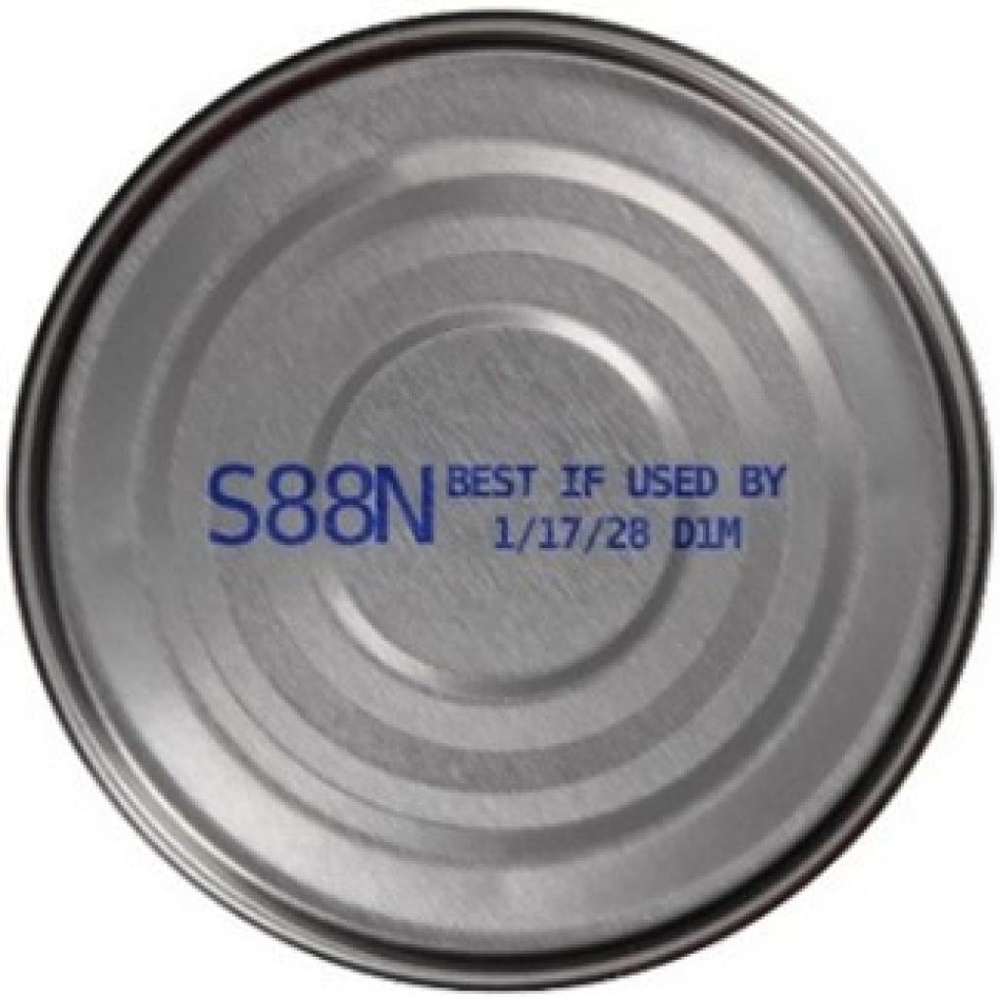
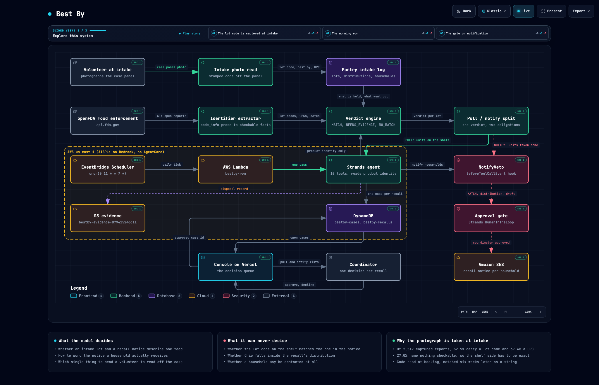

# Best By

An agent that watches the FDA food recall feed against what a food pantry
actually has on its shelves, and who already took some home.

Live console: **https://best-by.vercel.app**
Architecture: [`docs/architecture.html`](docs/architecture.html)
Repository: **https://github.com/kamalbuilds/best-by**

---

## The problem, measured

The FDA publishes a food enforcement report every time it classifies a firm's
recall. Between 2025-01-01 and 2026-09-02 it published 2,547 of them, which is
**29.3 a week**, from 815 different firms. Today **614 of those are still open**.
Every number on this page comes from `scripts/measure_feed.py`, which re-runs the
measurement against the captured corpus in `data/`, or with `--live` against the
API right now.

```
$ .venv/bin/python scripts/measure_feed.py
source: fda_food_enforcement_2025_2026.json, captured 2026-09-14, openFDA last_updated 2026-09-02
food enforcement reports: 2,547

what the notice publishes to identify affected units
  lot or batch code          829 / 2,547   32.5%
  UPC                        953 / 2,547   37.4%
  printed best-by date       808 / 2,547   31.7%
  best-by but no lot code    519 / 2,547   20.4%
  'all units' language       191 / 2,547    7.5%
  nothing checkable          688 / 2,547   27.0%

where the notice says the product went
  named states             1,964 / 2,547   77.1%
  nationwide                 414 / 2,547   16.3%
  neither stated             169 / 2,547    6.6%

status and severity
  Ongoing                    614 / 2,547   24.1%
  Class I                  1,090 / 2,547   42.8%
```

A pantry coordinator gets these as email, addressed to nobody, written for a
regulator. The affected units are identified inside a free-text field called
`code_info`, which is whatever the firm's regulatory affairs person typed. The
614 open reports publish **1,597 separate identifier strings** between them:
699 lot codes, 306 barcodes, 592 printed dates. Reading them is 33,841 words.
Acting on them means walking the shelves with a printout.

Mostly nobody does. So recalled food gets handed to the people least able to
absorb the consequences.

The number that decides the architecture is the last one: **27.0% of food
recalls publish nothing a shelf can be checked against at all**, and another
20.4% publish only a printed best-by date and no lot code. If you go looking for
a lot code when a notice lands, a quarter of those walks end at a case whose code
cannot be compared to anything.

---

## The one idea

**Read the lot code at intake, from a photograph, not at recall time.**

A pantry books in a donation: a volunteer has the case in their hands and a
phone in their pocket. Photographing the stamped panel costs four seconds. The
code becomes a string in a table before anyone knows a recall is coming.

Six weeks later, when the notice arrives, the comparison is
`"s88nd1m" in {...}` against all 614 open recalls at once. Exact, instant,
auditable. Nobody walks anywhere unless the answer is yes.

Here is that, end to end, with nothing arranged in advance.

The FDA published this photograph of the stamped bottom of a recalled Genova
can. It is in the repo at `data/labels/genova-tuna-lotcode-bottom-F-0610-2025.jpg`,
with its source URL in `data/labels/PROVENANCE.json`.



`agent/label.py` sends it to Claude Sonnet 4.5 with a Pydantic structured output
schema and a prompt whose whole purpose is to make "unreadable" an easier answer
than a guess:

```
$ .venv/bin/python -m pytest tests/test_label.py -m live -q

image_legible: True
summary: Can bottom showing ink-jetted lot code "S88N D1M" with best-by date "1/17/28";
         no UPC, product name, or net weight visible in this photograph.
  product_name  not_present  value=None       conf=0.0
  lot_code      read         value='S88N D1M' conf=0.95  region='ink-jetted on the bottom of the can'
  best_by       read         value='1/17/28'  conf=0.95  region="ink-jetted on the bottom of the can after 'BEST IF USED BY'"
  upc           not_present  value=None       conf=0.0
  net_weight    not_present  value=None       conf=0.0

parsed best_by -> 2028-01-17
```

It read `S88N D1M`, and it said `not_present` for the barcode rather than
inventing digits that are not on the bottom of a can.

Now the live feed. openFDA **F-0617-2025**, Chicken of the Sea / Tri-Union
Seafoods, status Ongoing, Class II, "Product's easy-pull lid was not secured
properly and may cause the product to become adulterated with the hazard
clostridium botulinum." Its `code_info` recalls **exactly one lot**:

```
$ curl -s "https://api.fda.gov/food/enforcement.json?search=recall_number:%22F-0617-2025%22" | jq -r '.results[0].code_info'
Best By dates: 01/17/2028 Lots: S88N D1M
```

That whole string is the notice's identification of the affected units. It is
free text. `agent/feeds/openfda.py` has to turn it into
`lot_codes=("S88N D1M",)` and `best_by_dates=(date(2028, 1, 17),)`, and be right
about a firm that wrote the date first and the lot second, with no comma.

So the photograph the volunteer took at intake in July is the thing that makes
this a four-case pull and a ten-household phone list in September, and the
verdict engine can name the comparison that decided it:

```
pass distribution:     the notice says the product went nationwide
pass product_identity: 90% of the intake line's words appear in the notice
pass lot_code:         lot S88N D1M is among the 1 recalled codes (S88N D1M)
```

That last line is what makes taking 84 cans off a shelf defensible to the food
bank that sent them.

---

## Pull and notify are two different jobs

This is the part that makes Best By a product rather than a matcher.

A recall splits a pantry's obligation in half, and the halves have different
recipients, different urgency and different failure modes:

- **PULL** is the units still on the shelf. A volunteer walks to a named bay and
  takes cases off. This is a chore, and a pantry can do it.
- **NOTIFY** is the units that already went home with a household. Nothing can
  be pulled. Someone has to be told, by name, that food they were given is being
  recalled and why. This is the only half that reaches a person who might
  otherwise eat it.

A system that reports "147 affected units" has told the coordinator nothing they
can act on. `agent/engine/sweep.py` computes both from one verdict, and
`notify_households` is gated on the distribution record, not on the verdict, so a
recall that matched 36 bags of popcorn nobody ever took home cannot mail anyone.

It also groups every affected lot under one recall. **One interruption per
notice, not one per case.** A pantry that gets interrupted fourteen times for one
recall stops reading the interruptions, which is the failure the paper process
already has.

---

## The real run

23 intake lots, 2,239 units on the shelf, 319 units already distributed to 14
households, against every open FDA food recall, live:

```
$ .venv/bin/python -m agent.run --live

Riverbend Community Pantry, Dayton OH
23 intake lots, 2239 units on the shelf, 319 units already distributed to 14 households
checked against 614 open FDA food recalls (202 pairs judged, source: live openFDA)

10 interruption(s): pull 23 case(s), notify 14 household(s), check 9 lot(s) by hand
32 lot(s) were compared against a recalled code and stay on the shelf

[same_day] H-0835-2026 Class I
  pull 5 cases, notify 8 households
  Good & Gather Mexican Street Corn Trail Mix 8 oz bag UPC 085239270240, 8 bags per case
  hazard: potential presence of Salmonella
    PULL   5 case(s), 38 units, Dry Goods C2, lot none  [best_by]
    NOTIFY 8 household(s), 53 units, 8 with a child under five

[today] F-0610-2025 Class II
  pull 7 cases, notify 14 households
  Genova branded Solid white Tuna; In Olive Oil; Wild Caught; NET WT. 5 OZ (142g)
  hazard: Product's easy-pull lid was not secured properly ... clostridium botulinum
    PULL   4 case(s), 84 units, Dry Goods A3, lot S88N D1M  [lot_code]
    PULL   3 case(s), 62 units, Dry Goods A3, lot S94N 42K  [lot_code]
    NOTIFY 14 household(s), 86 units, 8 with a child under five

[today] F-0617-2025 Class II
  pull 4 cases, notify 10 households
    PULL   4 case(s), 84 units, Dry Goods A3, lot S88N D1M  [lot_code]
    NOTIFY 10 household(s), 63 units, 8 with a child under five

[today] H-1174-2026 Class II
  pull 4 cases, notify 5 households
  Amy's ORGANIC SOUPS LENTIL LIGHT IN SODIUM NET WT. 14.5 OZ. (411 g)
  hazard: Potential for spoilage.
    PULL   4 case(s), 41 units, Dry Goods B1, lot 60D0924  [lot_code]
    NOTIFY 5 household(s), 26 units, 1 with a child under five

[this_week] H-1234-2026 Class III
  pull 3 cases
    PULL   3 case(s), 36 units, Dry Goods C4, lot none  [all_codes+upc]

[check] H-1223-2026 Class II
  check 1 lot
  Pumpkin Tree Peter Rabbit Organics Banana & Strawberry fruit puree, 4oz/113g pouch
    CHECK  INT-2026-0806-02 in Family Shelf D1
           go and read: the lot code stamped on the case in Family Shelf D1
```

Four different identifiers decided those, which is the point of extracting all
four: a lot code for the tuna and the soup, a printed best-by date for the
Class I trail mix (that notice publishes no lot code at all), and "all units"
plus a barcode for the popcorn.

**32 lots were compared against a recalled code and stay on the shelf.** That is
the answer a pull-everything process cannot give, and it is worth more than the
matches. 108 cans of Amy's lentil soup in lot `60G1187` keep getting handed out,
because `60D0924` is the only lot the FDA recalled, and the record says so.

---

## What the model is for, and what it is not for

**The model reads identity. The model never decides eligibility.**

An enforcement report is half product description and half microwave
instructions. An intake line is whatever a volunteer wrote on a clipboard.
Deciding those describe the same food is reading comprehension. Deciding whether
a case is inside the recalled batch is string and date comparison, and it happens
in `agent/engine/verdict.py`, where no prompt reaches it.

The seam is enforced three times:

1. `judge_identity` accepts the model's read and returns the verdict computed
   from it. The model learns the outcome; it never chooses one. An
   `IdentityAssertion` may replace the soft lexical check and nothing else: it
   cannot touch the UPC, the lot code, the best-by date, or the distribution
   state. `tests/test_verdict.py` has the model insist at full confidence that a
   jar of Skippy is a can of recalled lentil soup, and the lot code still wins.
2. `NotifyVeto`, a Strands `BeforeToolCallEvent` hook, cancels
   `notify_households` unless the ledger holds a MATCH, a distribution record,
   and a drafted notice.
3. `approval_gate`, a Strands `HumanInTheLoop` intervention with
   `allowed_tools=["*", "!notify_households"]`, means the coordinator approves
   before any household is contacted, even in a session where everything else has
   been trusted.

### What the model is measurably worth

The deterministic pass alone raises **10 interruptions**. Four of them are FDA
recalls of Ritz Peanut Butter Cracker Sandwiches, matched against two jars of
peanut butter, because "peanut" and "butter" are 40% of a short intake line.

Run the same pass with the model reading identity and it opens **6 cases**:

```
$ .venv/bin/python -m agent.run --live --dynamo --agent

{"event": "verdict", "detail": "INT-2026-0718-02 vs F-0617-2025: MATCH by lot_code"}
{"event": "verdict", "detail": "INT-2026-0728-01 vs F-0610-2025: MATCH by lot_code"}
{"event": "verdict", "detail": "INT-2026-0704-01 vs H-1174-2026: MATCH by lot_code"}
{"event": "verdict", "detail": "INT-2026-0625-01 vs H-0835-2026: MATCH by best_by"}
{"event": "verdict", "detail": "INT-2026-0813-02 vs H-1234-2026: MATCH by all_codes+upc"}
{"event": "verdict", "detail": "INT-2026-0806-02 vs H-1223-2026: NEEDS_EVIDENCE by no_identifier"}
{"event": "verdict", "detail": "INT-2026-0709-02 vs H-0502-2026: NO_MATCH by product_identity"}
{"event": "verdict", "detail": "INT-2026-0902-02 vs H-0502-2026: NO_MATCH by product_identity"}
```

with the model's own reasoning in the transcript:

> None of these notices are about Jif Creamy Peanut Butter 16 oz jars. They all
> fail the product identity test.

Four spurious shelf walks a week is how a pantry learns to stop reading the
alerts. That is the whole of what the model buys, and it is enough.

### The gate, actually firing

The agent drafts the notice and then cannot send it:

```
{"event": "case_opened",      "detail": "b602180ab006f38b H-1174-2026 pull 4 cases, notify 5 households"}
{"event": "notice_drafted",   "detail": "b602180ab006f38b cites H-1174-2026"}
{"event": "awaiting_approval","detail": "b602180ab006f38b is drafted and waiting for a person"}
{"event": "pulled",           "detail": "b602180ab006f38b: 41/41 units"}
{"event": "record_filed",     "detail": "b602180ab006f38b -> s3://bestby-evidence-.../H-1174-2026.txt"}
```

The pull happened. The disposal record was filed. Five families have not been
emailed, because no human has looked at it yet, and the pass moved on rather than
hanging. Approvals come back through the console and are handed to the next
invocation.

### And the gate opening

A check that can only refuse is a wall. Hand the next run the case the
coordinator approved, in production:

```
$ aws lambda invoke --function-name bestby-run \
    --payload '{"agent":true,"approve":["73a4bb419a7da04b"]}' \
    --cli-binary-format raw-in-base64-out /dev/stdout

{"event": "approved", "detail": "73a4bb419a7da04b was approved by the coordinator"}
{"event": "notified", "detail": "73a4bb419a7da04b: 10 direct, 0 simulator"}
{"event": "record_filed", "detail": "73a4bb419a7da04b -> s3://.../F-0617-2025.txt"}
{"event": "awaiting_approval", "detail": "e5714a2475a62728 is drafted and waiting for a person"}
```

Ten real SES sends for the approved case, and the three cases nobody approved
still held. The compliance record for that case now reads:

```
  Household     Units  Last given   Under 5  Notified
  H-0166           10  2026-07-29         3  direct 010001a09feab49a-89ee8d4
  H-0214            9  2026-08-12         2  direct 010001a09feab55c-89313a7
  H-0104            6  2026-07-22         2  direct 010001a09feab639-330dd11
  H-0195            6  2026-08-05         2  direct 010001a09feab70d-62b20f8
  H-0143            8  2026-07-29         1  direct 010001a09feab7d0-775779e
  H-0248            6  2026-08-12         1  direct 010001a09feab89f-d2d6cff
  H-0171            5  2026-08-05         1  direct 010001a09feab96c-973a2dc
  H-0117            4  2026-07-22         1  direct 010001a09feaba3d-488f699
  H-0129            5  2026-08-26         0  direct 010001a09feabb2b-efc66ca
  H-0227            4  2026-08-19         0  direct 010001a09feabc2c-a593a8c
```

Every line carries the SES message id that proves it, and the households with a
child under five are listed first because botulism notices name under-fives as
the population at risk.

This is the notice the agent wrote and the coordinator approved, verbatim:

> We gave {household} {units} of Genova Yellowfin Tuna in Extra Virgin Olive Oil
> and Sea Salt (5 oz can) on July 18, 2026. This product is recalled because the
> lid may not seal properly, which can allow botulism contamination (recall
> F-0617-2025).
>
> Botulism is a serious illness that can cause paralysis and death.
>
> Do not eat this tuna. Do not open or taste it. Throw it away in a sealed bag or
> return it to the pantry for replacement.
>
> If anyone has eaten this product and feels sick, weak, or has trouble
> swallowing or breathing, call 911 immediately.

---

## The mutation proof

A check that cannot fail is worse than no check. `tests/test_veto.py` does not
assert on a predicate. It builds the real hook, hands it the real event shape
Strands produces, and replaces the sender with a recorder, so if the hook stops
working the failure is a recorded send to a real household id.

Break it on purpose. In `agent/bestby_agent.py`, make `NotifyVeto.inspect`
return immediately:

```
$ .venv/bin/python -m pytest tests/test_veto.py -q
FAILED tests/test_veto.py::test_the_hook_cancels_a_dispatch_that_is_actually_attempted
  AssertionError: the veto did not cancel the tool: with the hook removed, this
  case would have mailed households about soup that is not in the recalled batch
FAILED tests/test_veto.py::test_an_unknown_case_id_is_refused
2 failed, 14 passed in 1.86s
```

Restore it:

```
$ .venv/bin/python -m pytest tests/test_veto.py -q
16 passed in 0.78s
```

The suite also proves the gate is a check and not a wall:
`test_the_hook_lets_a_legitimate_dispatch_through` passes a case that genuinely
should notify, and
`test_the_gate_demands_approval_for_notify_even_when_it_was_trusted` runs the
real `HumanInTheLoop._requires_approval` against an agent state where
`notify_households` has already been trusted, and it still demands a person.

Full suite, from a clean shell with no credentials and no API key:

```
$ env -i PATH="$PATH" HOME="$HOME" .venv/bin/python -m pytest tests -q
120 passed, 3 deselected in 1.23s
```

The 3 deselected are marked `@pytest.mark.live` because they hit the real model
or real SES. They pass too, with credentials:

```
$ .venv/bin/python -m pytest tests -q -m live
3 passed, 120 deselected in 29.84s
```

Those three are the ones that prove the claims on this page: the vision model
reading `S88N D1M` off the real photograph, that read settling the real
F-0617-2025 recall from NEEDS_EVIDENCE to MATCH, and SES returning a real message
id. Every other test runs against real captured API responses in `data/`, never
an invented fixture.

---

## The compliance record

A pantry answers to its regional food bank and to a county health inspector, and
neither accepts "we got the email". `agent/compliance.py` writes a printable
record to S3 as the pass runs, one object per case. Real output, from
`s3://bestby-evidence-079415246611/riverbend-dayton/2026/09/14/F-0617-2025.txt`:

```
FOOD RECALL ACTION RECORD
==============================================================================
Pantry            Riverbend Community Pantry (Dayton, OH)
Case              73a4bb419a7da04b
Record written    2026-09-14T12:14:50+00:00

NOTICE
------------------------------------------------------------------------------
Recall number     F-0617-2025
Classification    Class II (Ongoing)
Recalling firm    Chicken of the Sea; Thai Union El Segundo, CA
Reason for recall
  Product's easy-pull lid was not secured properly and may cause the product to
  become adulterated with the hazard clostridium botulinum.

PRODUCT REMOVED FROM DISTRIBUTION
------------------------------------------------------------------------------
  Intake lot      INT-2026-0718-02
  Received        2026-07-18 from Miami Valley regional redistribution, pallet 4412
  Location        Dry Goods A3
  Quantity        84 units (4 case(s) of 24)
  Lot code        S88N D1M (source: label_photo)
  Checks that produced this decision:
    pass distribution: the notice says the product went nationwide
    pass lot_code: lot S88N D1M is among the 1 recalled codes (S88N D1M)

PRODUCT ALREADY DISTRIBUTED TO HOUSEHOLDS
------------------------------------------------------------------------------
  63 units across 10 household(s). 8 of those households include a child under five.

  Household     Units  Last given   Under 5  Notified
  H-0166           10  2026-07-29         3  not yet
  H-0214            9  2026-08-12         2  not yet
```

It carries the section nobody else keeps: **LOTS CHECKED AND FOUND NOT
AFFECTED**. That is the only thing that justifies having continued to hand out
the rest of the pallet, and it is the section an inspector asks for.

`not yet` means not yet. A record that reads as sent when nothing was sent is
worse than no record.

---

## What is real and what is representative

Being precise about this, because the difference matters.

**Always live and always real:**

- Every recall. `agent/feeds/openfda.py` reads
  `https://api.fda.gov/food/enforcement.json` directly, no auth. The Lambda
  fetches it fresh on every run. The corpus in `data/` is a verbatim capture of
  that API on 2026-09-14, used so the test suite runs offline.
- Every lot code, barcode, best-by date and distribution state in a notice, and
  every measurement on this page.
- The intake photograph, which is the FDA's own published image of the recalled
  product, with its source URL in `data/labels/PROVENANCE.json`.
- The vision read, the verdict, the Lambda run, the DynamoDB rows, the S3
  records, and the SES sends.

**Representative, and disclosed in `data/pantry.json` as well as here:** the
pantry's intake log. Riverbend Community Pantry is a representative pantry
serving roughly 300 households a month. Every brand, product name and net weight
in it is a real product. Every UPC and every best-by date it carries was taken
from a live openFDA report and is cited per-lot in the file's `provenance` block.
The lot codes on the four lots inside an open recall are the real recalled codes
published by the firm, and **Best By finds them by matching; they are not flagged
in the file**. The lot codes on lots that are not inside a recall are in the
manufacturer's real stamping format and are not published anywhere. Quantities,
donors, shelf locations, households and distribution records are representative.

Household contact addresses are at `getava.xyz`, a domain this account has
verified with SES. SES is in sandbox here, so `agent/dispatch.py` records
`intended` (the household's own address) alongside `to` (where SES actually
accepted it) and a `mode` of `direct`, `simulator` or `failed`. A coordinator
reading a case in six months has to be able to tell a notice that reached a
family from one that reached a mailbox simulator.

**Not built, stated plainly:**

- **The console is read-only.** The approval path works and is proven above, but
  the coordinator hands a case id to the next run rather than clicking a button:
  `--approve <case_id>` locally, or `{"approve": ["<case_id>"]}` in the Lambda
  payload. Wiring a button to that would be a write endpoint and an auth story,
  and neither exists yet, so the console does not pretend to have one.
- **FSIS**, which publishes meat and poultry recalls, is the obvious second feed
  and would need no engine changes, since `agent/feeds/base.py` is already the
  seam. Its API is blocked by a WAF from the network this was built on, so it is
  not wired up rather than half wired up.
- **One pantry.** `load_pantry` takes a path and the Lambda reads one file. The
  multi-tenant version is a loop and a partition key, both of which already
  exist, but it has not been run with two pantries so it is not claimed.
- **The intake app does not exist.** `scripts/read_intake_photo.py` runs the
  read end to end from a shell, and it is the code a phone would call, but the
  volunteer-facing capture screen is not built.

---

## Architecture



Interactive version with source citations: [`docs/architecture.html`](docs/architecture.html).

```
openFDA food enforcement  ->  identifier extractor  ->  verdict engine  ->  pull / notify split
       (live, no auth)         agent/feeds/openfda      agent/engine        agent/engine/sweep
                                                         /verdict.py
                                       ^                     ^                      |
                                       |                     |                      v
intake photograph  ->  agent/label.py  |              Strands agent        DynamoDB  +  S3 record
 (volunteer, once)      vision read    |          agent/bestby_agent.py     cases       compliance
                                       |                     |                      |
                              pantry intake log       NotifyVeto hook               v
                                agent/shelf.py        HumanInTheLoop         Next.js console
                                                             |                      |
                                                             v                      v
                                                      SES notices  <---  coordinator approves
```

| Piece | Where |
|---|---|
| Scheduled pass | Lambda `bestby-run`, EventBridge `bestby-daily`, `cron(0 11 * * ? *)` |
| Case and recall state | DynamoDB `bestby-cases`, `bestby-recalls` |
| Compliance records | S3 `bestby-evidence-079415246611` |
| Household notices | SES, sender `bestby@getava.xyz` |
| Console | Next.js on Vercel, reads DynamoDB server-side |
| Model | Claude Sonnet 4.5 via `strands.models.anthropic.AnthropicModel` |

The schedule fires at 11:00 UTC, which is 07:00 in Dayton: when the coordinator
arrives, an hour before the first distribution shift. A recall check that lands
at midnight is a recall check nobody reads.

**Bedrock and AgentCore are not available on this AWS account.** It is an AWS
India (AISPL) account, where every Bedrock model in every region returns
`Operation not allowed`, for the account administrator too. Strands is
model-agnostic, so the agent runs against the Anthropic API directly while
Lambda, EventBridge Scheduler, DynamoDB, S3 and SES carry the rest. Lambda memory
is capped at 512MB on this account; the pass peaks at 109MB.

### The deployed function, invoked for real

```
$ aws lambda invoke --function-name bestby-run --payload '{}' \
    --cli-binary-format raw-in-base64-out --log-type Tail /dev/stdout

{"pantry_id": "riverbend-dayton", "ran_at": "2026-09-14T12:14:42+00:00",
 "lots_checked": 23, "units_on_shelf": 2239, "units_distributed": 319,
 "recalls_considered": 614, "pairs_evaluated": 202, "interruptions": 10,
 "cases_to_pull": 23, "units_to_pull": 345, "households_to_notify": 14,
 "lots_cleared_by_code": 32, "source": "live openFDA",
 "open_recalls_recorded": 614, "cases_opened": 10, "seconds": 8.9}

REPORT RequestId: 89fa9eb0-4695-4e98-86ca-c16a731896fe  Duration: 8941.87 ms
       Billed Duration: 9891 ms  Memory Size: 512 MB  Max Memory Used: 109 MB
```

---

## Running it

```bash
git clone https://github.com/kamalbuilds/best-by && cd best-by
python3.12 -m venv .venv && .venv/bin/pip install -e '.[dev]'

# The tests need nothing. No key, no AWS.
.venv/bin/python -m pytest tests -q

# Re-measure every number in this README against the captured corpus,
# or against the API right now.
.venv/bin/python scripts/measure_feed.py
.venv/bin/python scripts/measure_feed.py --live

# The deterministic pass. No model, no credentials.
.venv/bin/python -m agent.run --live
```

For the model and AWS paths, put `ANTHROPIC_API_KEY` in `.env` (`chmod 600`) and
export an AWS profile:

```bash
export AWS_PROFILE=palimpsest AWS_DEFAULT_REGION=us-east-1
.venv/bin/python -m agent.run --live --dynamo --s3 --agent
./infra/deploy.sh
```

The deterministic pass is the floor, not a fallback. A pantry whose API key
expires still gets its shelves checked against every open recall on stamped codes
alone; the model's identity read is layered on top.

## Layout

```
agent/feeds/openfda.py    identifier extraction from free-text code_info
agent/feeds/base.py       the shape every recall source reduces to
agent/shelf.py            the pantry intake log: lots, distributions, households
agent/label.py            the vision read at intake, and the honest refusals
agent/engine/verdict.py   MATCH / NEEDS_EVIDENCE / NO_MATCH. No prompt reaches it.
agent/engine/sweep.py     candidates, the pull/notify split, one interruption per recall
agent/bestby_agent.py     the Strands agent, NotifyVeto, the approval gate
agent/casefile.py         engine view to coordinator view
agent/compliance.py       the record a health inspector asks for
agent/dispatch.py         SES, and where a notice actually went
agent/store.py            DynamoDB
infra/lambda_handler.py   the unattended pass
infra/deploy.sh           role, package, function, schedules
console/                  Next.js decision queue
scripts/measure_feed.py   every number in this README
```

## Licence

MIT.
